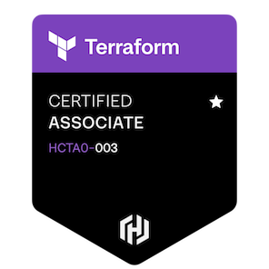

### Hi there 👋

<!--Credits for template: https://github.com/mansithanki -->


<!-- section - intro -->
# Akshay Jayaram
### Cloud | DevOps | AI
Welcome to my GitHub page! Here you'll find a collection of my projects and skills as a passionate software developer. I'm currently on the lookout for a full-time opportunity, eager to apply my skills and passion for innovation.

## About Me
Hi, I’m Akshay Jayaram, a software engineer with a Master’s degree in Computer Engineering from the University of California, Riverside. My expertise lies in cloud computing, DevOps, and infrastructure as code, with hands-on experience using AWS, Terraform, CloudFormation, Docker, and Kubernetes. I’m also deeply interested in cloud security and generative AI, and I enjoy integrating cutting-edge technologies into scalable, secure systems. Beyond the screen, I’m a nature enthusiast, a coffee lover, and a firm believer in work-life balance.

Happy to connect!
Email: akshayj1814@gmail.com

### aboutMe.yaml

```yaml
akshay:   
  technologies:
    programmingAndScripting: ["Python", "Go", "JavaScript", "TypeScript", "Bash/Shell scripting"]
    
    cloudServices:
      aws: ["EKS", "Lambda", "API Gateway", "SageMaker", "CloudFormation", "VPC", "S3", "EC2", "CloudFront", "CodeBuild"]
      azure: ["AKS", "Key Vault", "Azure AD"]
      
    devOpsAndInfrastructure:
      containerization: ["Docker", "Kubernetes", "Helm"]
      iac: ["Terraform", "CloudFormation", "Ansible"]
      cicd: ["Jenkins", "GitHub Actions", "ArgoCD"]
      monitoring: ["Datadog", "Splunk", "CloudWatch", "Sentry"]
      tools: ["Git", "Linux", "Rancher", "JFrog"]
      
    frameworksAndDatabases:
      frontend: ["React.js", "Next.js"]
      backend: ["Node.js", "Express.js", "GraphQL", "REST APIs"]
      databases: ["MongoDB", "DynamoDB", "MySQL", "PostgreSQL", "ElasticSearch", "Redis"]
      
    securityAndAuth: ["IAM", "OAuth 2.0", "OpenID Connect", "SAML 2.0", "Azure AD", "JWT"]
    
    projectManagement: ["Jira", "ServiceNow", "Agile/Scrum", "Power BI"]
```


<!-- section - job details -->

## Certification

<a href="https://www.credly.com/badges/cccaeb38-56ba-43fe-aa1b-c95a8dd4baac/public_url">
  
</a>
<a href="https://www.credly.com/badges/cccaeb38-56ba-43fe-aa1b-c95a8dd4baac/public_url">
  
</a>
<a href="https://www.credly.com/badges/f815036f-4eea-4422-b31c-0f4d84f58755/public_url">
  
</a>
<a href="https://www.credly.com/badges/73849694-12b1-4f52-91c2-2cf6fa46fd25/linked_in_profile">
  
</a>
<a href="https://learn.microsoft.com/en-us/users/jayaramakshay-7505/credentials/a7273c77d8291f2d">
  
</a>
<a href="https://learn.microsoft.com/api/credentials/share/en-us/JAYARAMAKSHAY-7505/A811E2FFEF3D52EF?sharingId=B6702B394732500D">
  
</a>


## Get in touch

<a href="https://www.linkedin.com/in/akshay-jayaram/"></a> &nbsp;

<a href="mailto:akshayj1814@gmail.com"></a> &nbsp;


